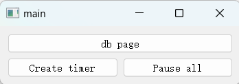
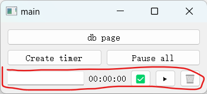
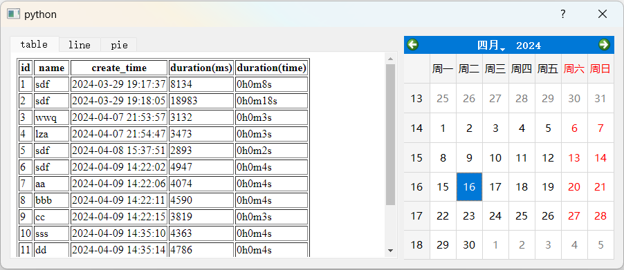
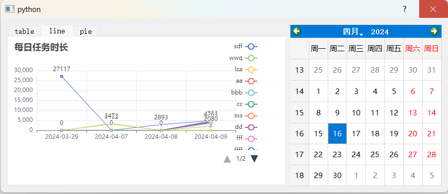
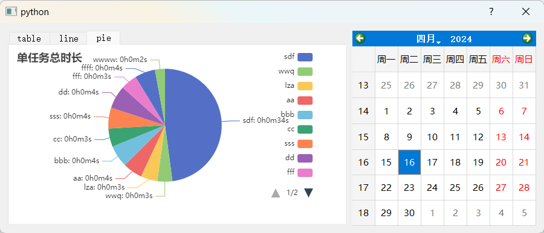
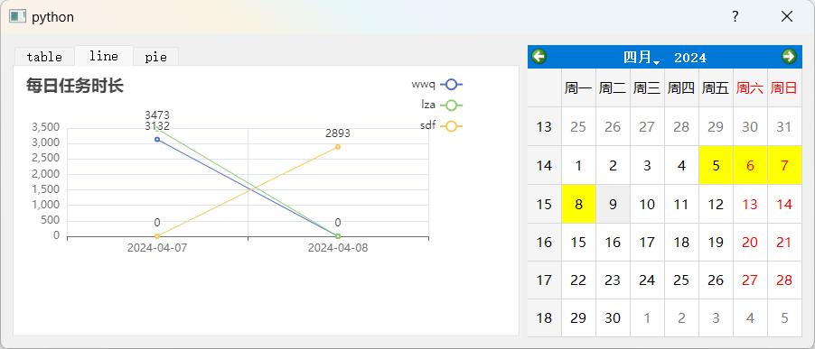

# simple timer 简单计时器

> 一个基于pyside2的简单的单线程计时器, 支持任务命名和时间统计, 帮助在写周报的你分析效率瓶颈。

<!-- [![NPM Version][npm-image]][npm-url]
[![Build Status][travis-image]][travis-url]
[![Downloads Stats][npm-downloads]][npm-url] -->

<!-- 用一两段话介绍这个项目以及它能做些什么。 -->

<!--  -->

## Getting Started 使用指南

### 主界面
主界面的布局分为上下两部分, 上半部分是控制的按钮, 包括 `db page`、`Create timer` 和 `Pause all` 按钮; 下半部分是可变的[计时行](#计时行)组件部分。

- 点击 `Create timer` 以新增[计时行](#计时行)
- 点击 `Pause all` 以暂停所有任务的计时
- 点击 `db page` 进入[数据展示对话框](#数据展示对话框)

### 计时行
点击[主界面](#主界面)的 `Create timer` 以新增计时行。

计时行组件从左到右分别是输入框、计时栏、完成按钮(`✅`)、启动/暂停按钮(`▶️`/`⏸️`)、删除按钮(`🗑️`)。一个计时行可以记录一个命名任务的任意数目条计时记录。

生成一条计时记录的操作过程: 
1. 点击输入框以命名计时任务
2. 回车或点击 `▶️` 以确定任务名称(确定名称后不可修改)
3. 点击 `▶️` 以开始任务计时, 同时该按钮会切换为 `⏸️`, 点击 `⏸️` 以暂停任务计时
    - 本应用为一心一用的单线程计时器, 当点击 `▶️` 开始某任务的计时时, 会暂停其他所有任务的计时
4. 点击 `✅` 以完成任务计时, 并将该任务的本次计时存入数据库, 归零计时
5. 重复3和4可以生成该任务名称的多条计时记录
6. 点击 `🗑️` 以删除计时行(不会对数据库有影响)

### 数据展示对话框
点击[主界面](#主界面)的 `db page` 进入数据展示对话框。

数据展示对话框分为左右两部分, 左半部分是数据库展示tab, 分为table、line、pie三个视图; 后半部分为日历组件, 用于展示数据的时间筛选。

#### table视图

以表格形式展示数据库(筛选后)数据, 每一行代表一条计时记录。列从左到右分别为: 
- `id`: 记录唯一标识符
- `name`: 任务名称
- `create_time`: 该记录的计时开始时间
- `duration(ms)`: 该记录的计时持续时间, 单位为ms
- `duration(time)`: 该记录的计时持续时间, 展示格式为时分秒

#### line视图

以折线图形式展示数据库(筛选后)数据, 每一条线代表一种同名任务随日期的单天计时时长变化, 单位为ms。可通过点击标签来筛选任务名称。

#### pie视图

以饼图形式展示数据库(筛选后)数据, 每个扇形代表一种同名任务的计时累积量(即筛选日期中, 该任务的计时总时长)。可通过点击标签来筛选任务名称。

#### 时间筛选

筛选操作: 
- 连续两次点击确定选择的时间范围, 选择精度为1天
    - 假设连续三次点击的日期分别为 `a`、`b`、`c`, 则在第二次点击后, 选中日期范围为 `[min(a, b), max(a, b))`, 第三次点击后, 选中日期范围为 `[min(b, c), max(b, c))`
- 被选中的日期会黄色高亮展示
- 连续两次点击同一天可取消时间筛选, 即展示所有时间的记录

计时记录选中判定标准:
1. 计时记录的时间实为一个时间点, 即创建时间 `create_time`
2. 连续两次点击确定的时间范围为左闭右开, 即小时间的早上0点到大时间的早上0点范围内
3. 当计时记录时间在选择时间范围内, 才被视为选中

### Installation 安装

1. 下载右侧release选择最新版本的exe下载
2. 运行下载的exe
3. 新增任务并保存会在exe同目录下生成st.db，此为保存用户计时数据的数据库文件，不要删掉或更改（除非你很清楚怎么改）

### Usage example 使用示例

<!-- ## Contributing 贡献指南

Please read [CONTRIBUTING.md](#) for details on our code of conduct, and the process for submitting pull requests to us.

请阅读 [CONTRIBUTING.md](#) 了解如何向这个项目贡献代码 -->

## Release History 版本历史

* 0.2.0
    * 带计时、存储、展示功能的计时器

## Authors 关于作者

* [YangShiqin](https://github.com/Yang-Shiqin)

## License 授权协议

这个项目 MIT 协议,  请点击 [LICENSE.md](LICENSE.md) 了解更多细节。
